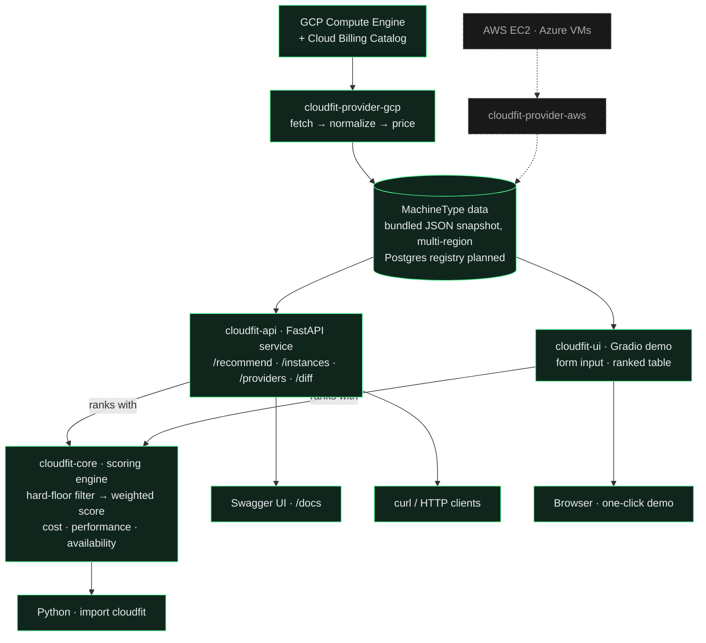

# cloudfit-io

**Cloud-agnostic machine type recommender for computational workloads.**

> Like a load balancer for cloud instances that recommends the best machine type for your workload across AWS, GCP, and Azure, and stays current as providers deprecate and release new types.

Built with bioinformatics and batch workflow orchestration as the primary use case, but designed to be domain-agnostic.

**New here?** Try the [one-click demo](https://chaitanyakasaraneni-cloudfit-ui.hf.space), or read the launch post: [Why I built cloudfit](https://ckasaraneni.com/blog/why-i-built-cloudfit) for the gap in existing free tooling (Compute Optimizer, Recommender, Advisor) and what cloudfit does about it.

---

## Libraries

| Package | Description | Status |
|---|---|---|
| [`cloudfit-core`](https://github.com/cloudfit-io/cloudfit-core) | Scoring engine · workload profiles · hard floor filters · region-aware · fit-based scoring (v0.3+) |  |
| [`cloudfit-provider-gcp`](https://github.com/cloudfit-io/cloudfit-provider-gcp) | GCP Compute Engine machine type fetcher (multi-region capable) |  |
| [`cloudfit-provider-aws`](https://github.com/cloudfit-io/cloudfit-provider-aws) | AWS EC2 instance fetcher | planning phase |
| [`cloudfit-api`](https://github.com/cloudfit-io/cloudfit-api) | REST API. `/recommend` · `/instances` · `/providers` · `/diff`. Multi-region snapshot bundled. |  · [live demo ↗](https://chaitanyakasaraneni-cloudfit-api.hf.space/docs) |
| [`cloudfit-ui`](https://github.com/cloudfit-io/cloudfit-ui) | One-click Gradio demo over the scoring engine. Workload profile in, ranked instances out. | [live demo ↗](https://chaitanyakasaraneni-cloudfit-ui.hf.space) |

## Architecture



Solid green = shipped · dashed grey = planned.

## Quick example

```python
from cloudfit import WorkloadProfile, MachineType, rank

profile = WorkloadProfile(
    vcpu=60,
    ram_gb=224,
    archetype="io",                # io | cpu | mem | gpu | burst
    optimize_for="balanced",       # cost | performance | availability | balanced
    region="us-central1",          # optional region hard floor (v0.2+)
)

# Candidate instances come from a cloudfit-provider-* package
# (e.g. `pip install cloudfit-provider-gcp`), or supply your own list:
candidates = [
    MachineType(id="t2d-standard-60",      provider="gcp", vcpu=60, ram_gb=240, price_hr=2.31, region="us-central1"),
    MachineType(id="c3d-standard-60-lssd", provider="gcp", vcpu=60, ram_gb=240, price_hr=3.39, region="us-central1"),
]

best = rank(profile, candidates)[0]
print(f"{best.instance.provider} {best.instance.id}  ${best.instance.price_hr}/hr  score: {best.score}")
# → gcp t2d-standard-60  $2.31/hr  score: 1.0
```

## Related projects

- [`samplesheet-parser`](https://github.com/chaitanyakasaraneni/samplesheet-parser): Format-agnostic Illumina SampleSheet parser (BCLConvert V2 + IEM V1)
- [`clinops`](https://github.com/chaitanyakasaraneni/clinops): Clinical ML data quality library

---

**Author:** [Chaitanya Krishna Kasaraneni](https://ckasaraneni.com)
&nbsp;·&nbsp; [Google Scholar](https://scholar.google.com/citations?user=Y2S8D2UAAAAJ)
&nbsp;·&nbsp; [ORCID 0000-0001-5792-1095](https://orcid.org/0000-0001-5792-1095)
